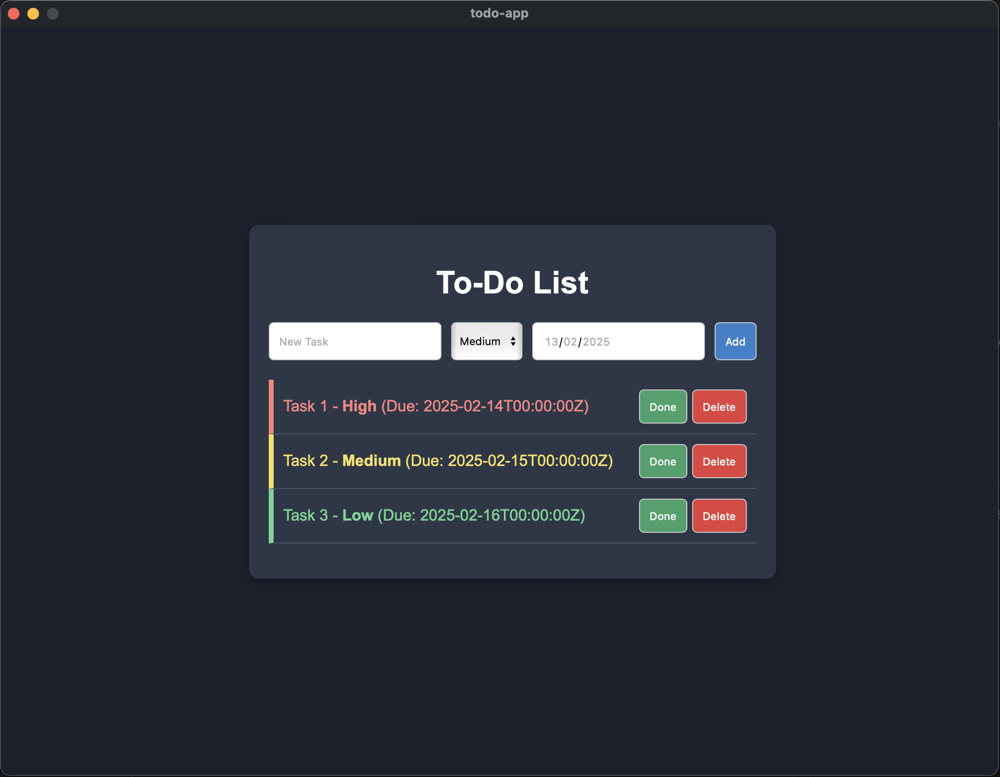

# To-Do List Application

This is a feature-rich To-Do List application built with React and Wails (Go backend). It allows users to manage tasks efficiently with priority levels and persistent storage.

## Preview



## Features

- **See list of tasks**

- **Add new tasks with priority and due date**

- **Mark tasks as done/undone**

- **Delete tasks**

- **Restore completed tasks**

- **Priority levels with color-coded labels**

- **Persistent storage using **SQLite** with **Go** backend**

- **Modern UI with styled buttons and icons**

## Technologies Used

- **Frontend**: React, TypeScript, CSS

- **Backend**: Go (using Wails)

- **Database**: SQLite (for persistent storage)

## Installation

### Prerequisites

- Node.js (for React)

- Go (for Wails)

- SQLite (for data storage)

- Wails installed (`go install github.com/wailsapp/wails/v2/cmd/wails@latest`)

### Steps

1. Clone this repository:

   `git clone https://github.com/bakdauletbaktygaliyev/go-todo-wails.git go-todo-wails && cd go-todo-wails`

2. Install frontend dependencies:

   `npm install`

3. Run the application:

   `wails dev`

## Project Structure

```
.
│── backend/                  # Go backend
│   ├── db/                   # Database setup
│   │   └── sqlite.go         # SQLite database connection
│   ├── models/               # Data models
│   │   └── task.go           # Task struct definition
│   └── crud.go               # CRUD operations for tasks
│
│── frontend/                 # React (TypeScript) frontend
│   ├── src/                  # Source code
│   │   ├── assets/           # Static assets and styles
│   │   │   ├── App.css       # Global styles
│   │   │   ├── App.tsx       # Main App component
│   │   │   ├── main.tsx      # Entry point for React app
│   │   │   ├── style.css     # Additional styles
│   │   │   └── vite-env.d.ts # TypeScript environment config
│── README.md                 # Project documentation
│── app.go                    # Wails app entry point
│── go.mod                    # Go module dependencies
│── main.go                   # Main Go application logic
│── tasks.db                  # SQLite database file
└── wails.json                # Wails configuration file
```

## License

This project is licensed under the MIT License.
